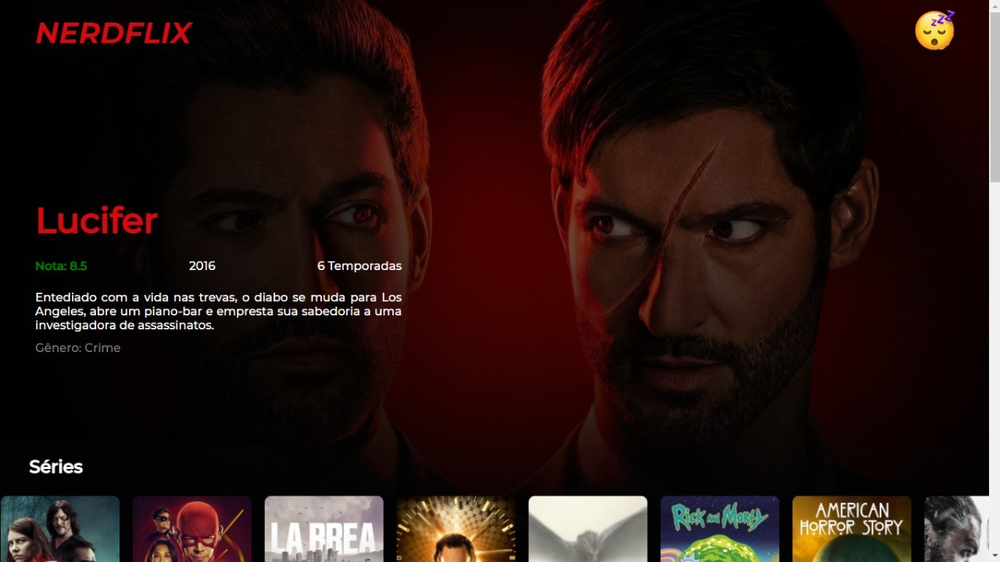

# NERDFLIX

Um clone do Netflix, porém voltado para obras de ficção científica e/ou fantasia

## [Confira aqui](https://nerdflix-alpha.vercel.app/)

---

## Sobre

Provavelmente esse é o maior projeto que já fiz até hoje. Para ver todo o "catálogo" é necessário ser autenticado com sua conta do Google, então autenticado, é possível ver todos os filmes e séries que estão no projetos. Todas as informações foram tiradas do api [TMDB (The Movie Data Base)](https://developers.themoviedb.org/3/getting-started/introduction).

---

## O que foi usado

- [ReactJs](https://reactjs.org/)
- [Styled-Components](https://styled-components.com/)
- [React Router Dom](https://reactrouter.com/web/guides/quick-start)
- [js-cookie](https://github.com/js-cookie/js-cookie)
- [Material Icons](https://mui.com/)
  
---